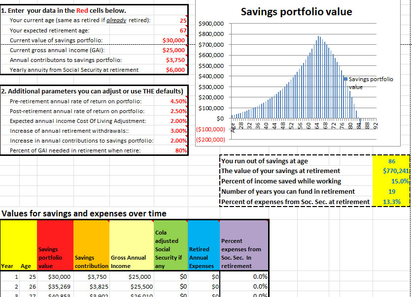

<title>personal finance spreadsheets</title>

<h1><B>Income Planning Tool</B> or <B>IPT</B> </h1>

<table>
<tr>
<td>

<b>Notice:</b> The following spreadsheets are all 
<A HREF="ForeverBetaCartoon.jpg"> <i>Beta-level</i></A> software <A HREF="https://en.wikipedia.org/wiki/Software_release_life_cycle">**</A>

</TD>
</TR>
</Table>

The <B>Income Planning Tool</B> or <B>IPT</B> is an Excel spreadsheet that calculates a personal finance glide-path of cash-flows from yearly income streams while subtracting expenses and taxes. This spreadsheet, comprised of a collection of worksheets, estimates yearly income from various sources: work, Social Security, pensions, annuities, and insurance; contributions and withdrawals from deductable retirement accounts (IRA, 401(k), 403(b), etc.), Roth IRAs, and savings investment accounts. Contributions and withdrawals may be specified for the investment and expense accounts. These may be entered as  <b>scheduled</b> (i.e., periodic with optional COLAs) or <b>irregular</b> (upcoming additional expenses - e.g., trip around the world, new house, new car, etc.), or both. The spreadsheet then estimates yearly federal tax rates, cash flows, and investment account balances as they accumulate. Results are presented as tables and glide-path graphs. To use the spreadsheet, enter your current data into <b>red</b> cells in the data entry worksheets. Also enter your age(s), estimates of the stock, bond and cash returns, CPI, COLAs, insurance, etc. The spreadsheet then estimates future values in the accounts affected. The  <b>Demo</b> version of the spreadsheet contains demonstration data examples that exercise all options. The <b>User</b> version provides no demonstration data; it  is the version you might use to enter your data. If you are interested, review the <A HREF="IPT-Introduction.pdf"><B>IPT-Introduction (PDF)</B></A> - the first worksheet of the IPT that describes how to use the spreadsheet (or downloading the spreadsheet itself and read the <B>Introduction</B> worksheet there).  

<B>DOWNLOAD</B> 
Download individual Excel files by clicking on the links for particular files in the following spreadsheet descriptions. After clicking on a particular spreadsheet hyperlink, then click on the <B>Download</B> button that will appear to download the Excel spreadsheet file to the location that your computer saves downloaded files (e.g., "download" directory on Windows, etc.).
To edit and save your data, the version of Excel on your computer may require you to click on "Enable Editing" if it says "Protected View" at the top of the screen when you first open the spreadsheet.

      
 

<table BGCOLOR="blue">
<tr>
<td>

<DL>
<CT>Current IPT Release</DT>
<DT>Full Demonstration Data
<DD>
<UL>
<LI><A HREF="IPT-Demo-V.0.25.02-10-02-2016a.xlsx">
<B>IPT-Demo-V.0.25.02-10-02-2016a.xlsx</B></A>
<LI>The full version demonstrates examples of typical user data for all data entry worksheets. In addition to demonstrating the spreadsheet, it is useful for seeing examples of typical answers.
</UL>
</DT>

<DT>User Entered Data
<DD>
<UL>
<LI><A HREF="IPT-User-V.0.25.02-10-02-2016a.xlsx">
<B>IPT-User-V.0.25.02-10-02-2016a.xlsx</B></A>
<LI>The User version of the spreadsheet has no data and is useful for entering your own data.
</UL>
</DT>
</DL>

</td>
</tr>
</table>
      
			
<B>SUMMARY:</B> 
			
This Excel spreadsheet is designed for people who want to plan for future income, saving, and spending needs. It calculates rough estimates of saving and spending patterns over time. You must enter summaries of a range of your personal financial data as required by the model. These include applicable investments (taxable and retirement), pension, Social Security, work, annuity, and expenses. The final results are shown in summary tables and glide-path graphs for those tables. All data are entered and calculations are done only in this spreadsheet. No data are exported or saved from the spreadsheet (either locally or to the Internet). Once the data are entered, the spreadsheet estimates yearly cash-flows using income from various sources: work, pensions, Social Security, annuities, and life insurance benefits; contributions and withdrawals from tax-deferred 401(k), 403(b), 457(b), IRAs, Roths, and savings investment accounts. The spreadsheet estimates yearly investment returns, taxes on investment returns, and expenses. It estimates yearly Federal tax rates and resulting cash-flows are estimated. The spreadsheet allows for scheduled and irregular (upcoming additional) contributions and withdrawals for investment accounts (IRA, Roth, Savings) as well as for scheduled and irregular expenses and deductions. From this data, the spreadsheet then calculates yearly net worth. Glide-path tables and graphs are created are useful for investigating different planning scenarios by making  changes to inputs.

The IPT software may be run in a variety of spreadsheet programs including Windows Excel, the free OpenOffice or LibreOffice "calc", Google "sheet". The spreadsheet doesn't use Microsoft Visual Basic as VBA is not available in all spreadsheet programs. Apple's "numbers" spreadsheet program has some incompatibilities, so use either Excel for Mac or one of the free spreadsheet programs.

Why model? Although models by nature are imprecise, calculating a rough estimate of your income stream may be useful for financial planning. The spreadsheet represents a compromise between complexity and completeness and leans in the direction of a simpler model. As statistician George Box noted, "All models are wrong, but some are useful." To illustrate the concept of glide-path modeling, a very crude glide-path calculator, "SimpleCalc", is available (both as a worksheet in the IPT spreadsheet and as a separate spreadsheet). This may be useful for you to experiment with to better understand the concept of  glide-path before using the full IPT spreadsheet, which uses a more complete financial planning model.  These spreadsheets are  educational tools.
 

<B>Previous IPT Releases:</B>
<UL>
<LI><A HREF="IPT-Demo-V.0.24.18-09-22-2016c.xlsx">
<B>IPT-Demo-V.0.24.18-09-22-2016c.xlsx</B></A>
<LI><A HREF="IPT-User-V.0.24.18-09-22-2016c.xlsx">
<B>IPT-User-V.0.24.18-09-22-2016c.xlsx</B></A>

<LI><A HREF="IPT-Demo-V.0.24.17-09-16-2016a.xlsx">
<B>IPT-Demo-V.0.24.17-09-16-2016a.xlsx</B></A> 
<LI><A HREF="IPT-User-V.0.24.17-09-16-2016a.xlsx">
<B>IPT-User-V.0.24.17-09-16-2016a.xlsx</B></A> 
</UL>

<B>See Appendix D</B> in the the IPT spreadsheet for the latest status and Revision-Notes History.  
<B>Revision notes</B> for V.0.25.02-10-02-2016a. Added optional alternate COLAs for S1 and S2 in the 10. ExpensesData 10.2.1 irregular expenses data entry table. This lets you specify COLAs for expenses that you expect to have a much higher or lower COLAs than the default expense COLA specified in 10.1.2. If the alternate COLA value specified is 0%, it defaults to the default expenses COLA. An example might be future college costs that may be on the order of 5%. Some COLAS may even be negative. Values of the S1 and S2 alternate COLAs  not zero are flagged with a green background. 
Also, fixed non-critical retirement age display link in 10.1 ExpensesData "S2 yearly expenses after retire at age". 

 
<B>Revision notes</B> for V.0.24.17-09-22-2016c. Changes were made based on some initial feedback from Bogleheads.org. The FAQ was edited and added entry 16. "Why are there separate COLAs for various income sources Work, Pension, Social Security and Annuities worksheets?". Added optional COLA overrides for the Work and Annuity data. Otherwise it uses the CPI. The TODO-List was updated for clarity. The ease of navigation to the Results worksheet was improved from all data entry worksheets. A dynamic total summary net worth glide-path results graph was added to each editable data entry worksheet so users may immediately see the results of any changes they make to the data.
     			

<li> The <a href="SimpleCalc-V.0.4.2-09-16-2016a.xlsx">
<B>SimpleCalc-V.0.4.2-09-16-2016a.xlsx</B></a> spreadsheet calculates an elementary retirement glide-path showing your finances over time. Enter a few required parameters and the spreadsheet computes a table of savings over time. The table data are also plotted as a glide-path graph, shown in the following screen shot. At retirement, it estimates your expenses as a percentage of your earlier income. This is taken from social security annuity income and the remainder take from (or added to) your savings. If your savings run out over time, then that age is an estimate of the longevity of your savings. The savings contributions, expenses, Social Security are adjusted yearly by the rates and CPI specified. This spreadsheet is the same as the <i>SimpleCalc</i> worksheet included in the IPT spreadsheet above and is offered as separate spreadsheet for convenience. Enter your data in the <b>red</b> cells overwriting the existing demonstration data.
 

</li>
</ol>

<h1>Additional Personal Finance Excel Spreadsheets</h1>

Here are a few additional spreadsheets that may be useful. They are <I>not</I> part of the IPT spreadsheet.

<li> The <a href="Generic-Internal-RateOfReturn-2006-2015-rev.08-05-2016a.xlsx">
<B>Generic-Internal-RateOfReturn-2006-2015-rev.08-05-2016a.xlsx</B></A>
spreadsheet estimates the 10-year (2005-2015) Internal Rate of Return (IRR) of an investment portfolio and compares it to that of a total market portfolios IRR corresponding to your personal asset allocation.  
<B>VERSION:</B> 0.4 Beta, 8-05-2016

  

</li>

<li> The <a href="SpendableNetWorth-2015-V.4-08-05-2016.xlsx">
<B>SpendableNetWorth-2015-V.4-08-05-2016.xlsx</B></a> 
spreadsheet estimates how much your invested assets are worth as spendable assets (i.e., after taxes). You may estimate this three ways: 1) if the assets are sold slowly over a lifetime; 2) you may optionally sell some of your assets from your taxable investment, tax-deferred IRA, or Defined Contribution (DC) plan (above the RMD amount) accounts; and alternatively, 3) you may liquidate all of your assets in one year putting you into a higher tax bracket.   
<B>VERSION:</B> 0.5.4 Beta, 8-05-2016

</li>

<li> 
The <a href="Chained-CPI-U-calculation-V.4-08-05-2016.xlsx">
<B>Chained-CPI-U-calculation-V.4-08-05-2016.xlsx</B></a>
spreadsheet estimates the effect of changing the Social Security COLA from CPI-W to the Chained-CPI-U. It could also be used for estimating the effect of using the CPI-E (elderly) that has been proposed from time to time.   
<B>VERSION:</B> 0.4, 8-05-2016. 

</li></ol>

<pre></pre>
<table BGCOLOR="yellow">
<tr>
<td>
<b>Disclaimer:</b> The software computes various personal finance estimates using simplified models. No claim is made to the accuracy, suitability, and correctness of the algorithms. Note, estimates become less accurate over time. As the software uses static models and static rates of return, CPI, etc., it will not track actual market values over time. The software	uses only Excel formulas and <I>does not use Visual Basic (VBA)</I>, so one may easily review all computations as desired. Because it uses generic spreadsheet coding (with no VBA), it will run in a variety of spreadsheet programs such as Windows Excel, free OpenOffice or LibreOffice "calc", free Google"sheet", etc. <B>Use this software at your own discretion and risk,</B> as an initial way to think about personal finance problems. This is educational software. Absolutely no warranty is offered for this software and no responsibility is taken for any errors in or use of the software. 
</td>
</tr>
</table>

----------

<address>
<B>Revised:</B> October 2, 2016
 
<B>License:</B> GNU General Public License, version 3.0 (GPLv3) at
[http://opensource.org/licenses/gpl-3.0.html](http://opensource.org/licenses/gpl-3.0.html)
  
<b>Web:</B> [https://github.com/finplanIPT/IPT/README.md](https://github.com/finplanIPT/IPT/README.md)
 
<B>E-mail:</B> <A HREF="mailto:finPlan.IPT@gmail.com">finPlan.IPT@gmail.com</A>

</address>
